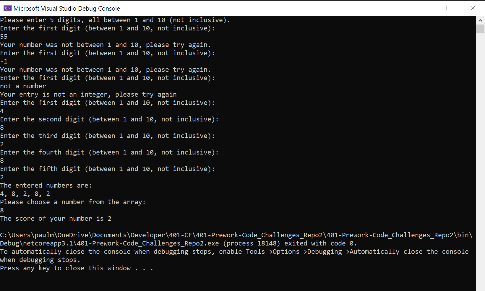
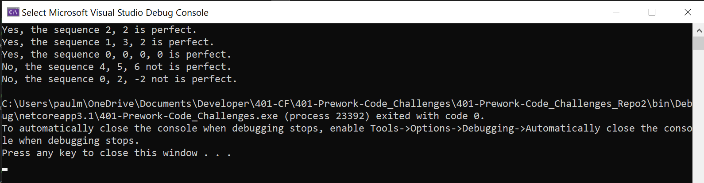
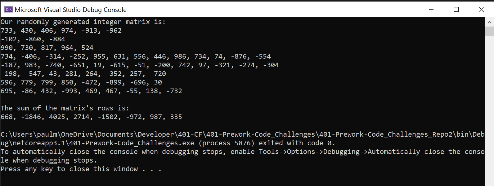

# 401 - Prework - Code Challenges

***

## Problem 01

Problem Title: Array Max Result

Description: the instructions didn't match the name of this challenge, but here they are as I read them:

1. Ask the user for five integers between 1 - 10 (not inclusive).
2. Display those five integers back to the user.
3. Ask the user to choose an integer from the array.
4. Compute a "score" that is the number of times that integer occurs multiplied by the integer itself.
5. Display the score to the user.

Inputs:
User input of valid integers.

Output:
Console printout of the score.

Assumptions:
- No checking whether the integer from the array is actually in the array. If the user picks an integer not in the array, the score is simply 0.
- No checking whether the integer from the array is between 1 - 10.

***

## Problem 02

Problem Title: Leap Year Calculator

Description: determine whether a given year is a leap year from the following conditionals:
- The year is divisible by 4
UNLESS
- The year is divisible by 100
EXCEPT
- The year is divisible by 400

So while the year 2100 and 2400 both satisfy the %4 and %100 rule, 2400 also falls under the %400 rule, so it is a leap year, while 2100 is not.

Inputs:
A year represented by an integer.

Output:
Console printout of whether the given year is a leap year.

Assumptions:
- Can only handle years respresented by integers. Behavior for other numerical types is not guaranteed. Cannot handle years represented by a Date object or similar.

***

## Problem 03

Problem Title: Perfect Sequence

Description: determine if an array of integers are a perfect sequence. A perfect sequence is defined as one where the element's sum is equal to their product.

Inputs:
An array of integers.

Output:
Console output denoting whether the sequence is perfect.

Assumptions:
- Is supplied with an array of integers. Behavior unknown with any other numerical or data type.

***

## Problem 04

Problem Title: Sum of Rows

Description: given a 2d matrix of integers, return a 1d array that is the sum of each row of integers. In other words, given an array of arrays, return an array of of the sum of each of the inner arrays.

Inputs:
None. We'll be randomly generating the 2d matrix.

Output:
An array where each element is a sum of one of the matrix's rows.
